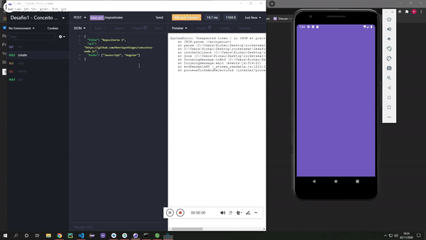

# conceitos-react-native
Desafio dos conceitos de React Native

Foi utilizado React Native para a criação das funcionalidades de listar os repositórios que foram cadastrados e permitir que o usuário dê o "like" naquele repositório.

### funcionamento:

